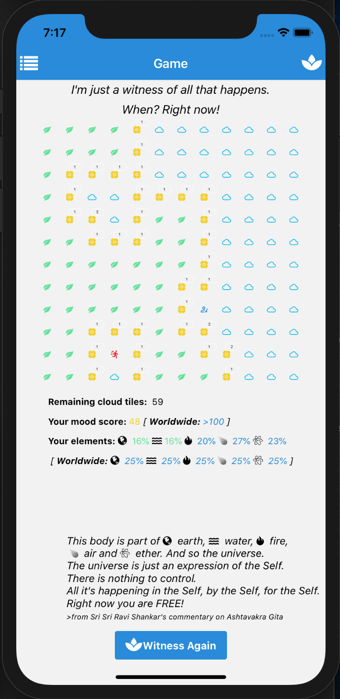
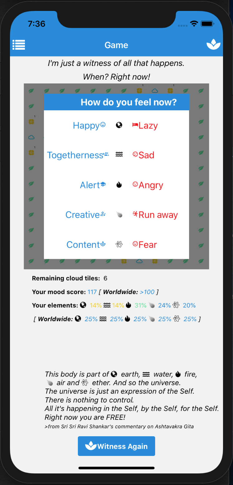
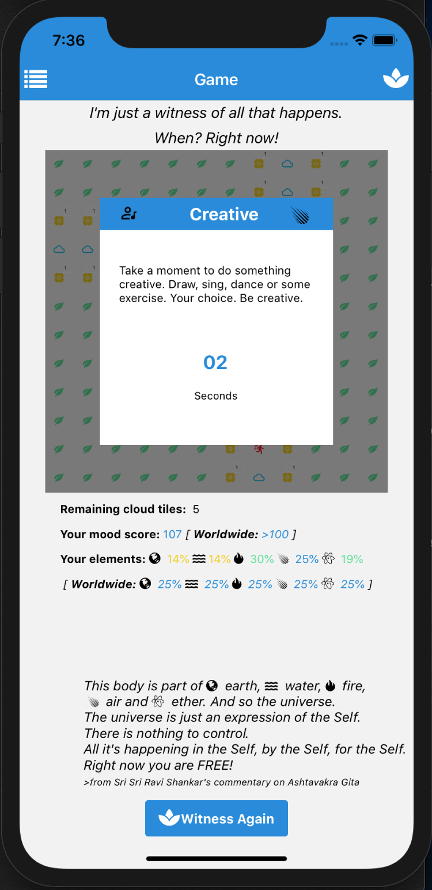
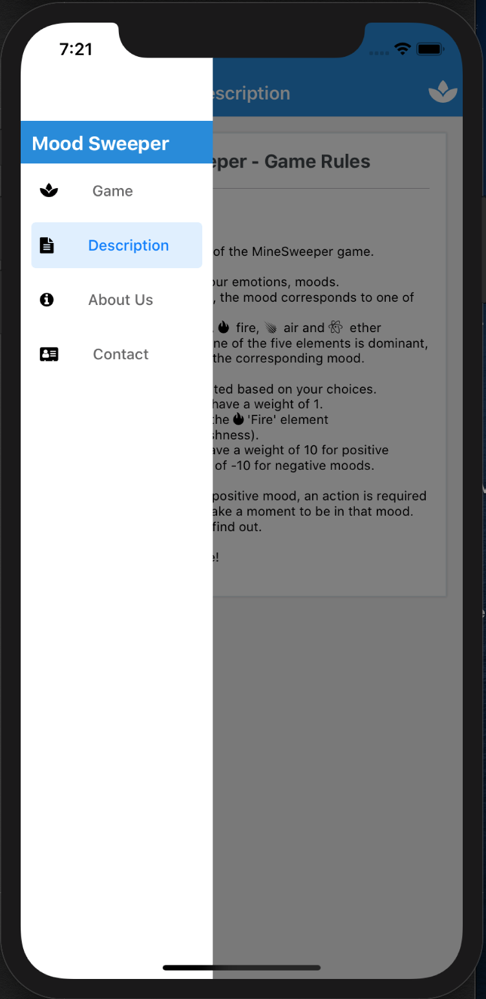

# MoodSweeper

A twist of the MineSweeper game. The bombs are replaced with moods and you are given tips to change those moods when you encounter them.

Main  | Moods  | Positive Mood  | Navigation
------------- | ------------- | ------------- | -------------
 |  |  | 


## Launch the game from the source code

After you clone the source code, install it locally:

```
yarn install
yarn ios
yarn web
yarn android
```

## Implementation

The code is written in javascript, using react native elements. There are no non-react native elements used, so it's compatible with mobile applications.

The mine sweeper game logic is implemented in the 'common' folder. The layout of the game is implemented in 'components' folder. The code uses 'redux' to pass around states and actions between React components. All other files are generated through `expo init` command.

## Enjoy the experience!